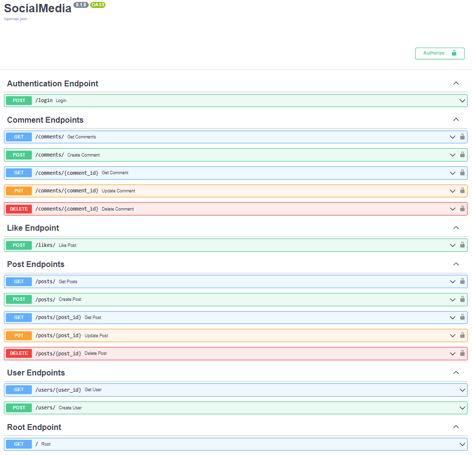

## Social Media.

### Description.

The social media application provides users with the ability to create, modify, update, delete, and view a variety of posts.

### Installation.

**NOTE**: Python3 must be already installed.

```shell
git clone https://github.com/Vasyl-Poremchuk/social-media
cd social_media
python -m venv venv
venv\Scripts\activate (Windows) or sourse venv/bin/activate (Linux or macOS)
pip install -r requirements.txt
```

**NOTE**: Before running the application, you must create an **.env** file and fill it using the template in the **.env.sample** file.

### Running the application on the local machine.

```shell
uvicorn src.main:app --reload
```

### Running the application via the docker container.

If you want to run the development version of the docker container, use the command below:

```shell
docker-compse -f docker-compose-dev.yml up -d
```

If you want to run the production version of the docker container, use the command below:

```shell
docker-compose -f docker-compose-prod.yml up -d
```

### Swagger documentation.

The social media app has several endpoints available, which you can check out in the swagger documentation (use **/docs** to check).



### Heroku deployment.

If you want to deploy this application on **Heroku**, follow the steps below:

- Sing in to your Heroku account or sign up using this [LINK](https://www.heroku.com).
- Install the Heroku Command Line Interface (CLI) from this [LINK](https://devcenter.heroku.com/articles/getting-started-with-python#set-up).

**NOTE**: Before installing the CLI, I strongly recommend that you close the IDE and any open terminals. This can save you from possible problems in the future.
- Use the command below to log in to the Heroku CLI.
```shell
heroku login
```
- Then fill in you credentials in the tab that opens in your browser.
- Create an app on Heroku using the command below.
```shell
heroku create <unique_name_of_your_app>
```
- Create a Procfile with a command that run our application on Heroku, you can use the command below.
```shell
web: uvicorn src.main:app --host=0.0.0.0 --port=${PORT:-5000}
```
**NOTE**: The Procfile is located at the root of the folder.
- Push your application on Heroku using the command below.
```shell
git push heroku master
```
- Create a PostgreSQL instance using the command below.
```shell
heroku addons:create heroku-postgresql:mini
```
**NOTE**: You can use any available PostgreSQL instance on Heroku.
- Add all necessary config variables on Heroku (App Dashboard -> Settings -> Config Vars -> Reveal Config Vars). You must add all the variables that exist in the **.env.sample** file on Heroku.
- Connect to the PostgreSQL instance using pgAdmin. Create a new instance in pgAdmin and fill in all the fields using the credentials available on Heroku (Datastores -> your_postgresql_instance -> Settings -> Database Credentials -> View Credentials).
- Update your Heroku PostgreSQL instance using the command below.
```shell
heroku run "alembic upgrade head"
```
- Restart the instance by running the following command.
```shell
heroku ps:restart
```

- Check it out: [LINK](https://social-media-fastapi-app.herokuapp.com/docs).

### AWS deployment - EC2 instance & RDS PostgreSQL database (optional).

**NOTE**: You must already be registered before deploying an application on AWS.

Creating an **RDS PostgreSQL** database:

- In the AWS search, type **RDS**.
- Then select the **Dashboard** field and click the **Create database** button.
- Choose a database creation method - an **Easy create**.
- Choose an engine options - a **PostgreSQL** (select the latest engine version available).
- Choose a sample template to meet your use case (you can use the **Free tier** or any other).
- Configure your credentials, such as **DB cluster identifier**, **Master username**, & **Master password**.
- Set **Public access** to **Yes**.
- Another configuration can be set as default or selected as desired.
- Click the button **Create database**.
- When the state of the database instance is **Available**, update the **Security group rules**.
- Delete existing **Security group rules** & set new ones.
- Click the **Inbound rules** button, then click the **Edit inbound rules** button.
- Click the **Add rule** button, & then add a new **Security group** with a **Type** of **PostgreSQL** & a default value of **Anywhere-IPv4**.
- Choose **Save rules**.

Using **pgAdmin** to connect to an RDS for **PostgreSQL** DB instance:

- Launch the pgAdmin application on your client computer.
- On the **Dashboard** tab, choose **Add New Server**.
- In the **Create - Server** dialog box, type a name on the **General** tab to identify the server in pgAdmin.
- On the **Connection** tab, type the following information from your DB instanse:
    + For **Host**, type the endpoint, for example **mypostgresql.c6c8dntfzzhgv0.us-east-2.rds.amazonaws.com**.
    + For **Port**, type the assigned port.
    + For **Username**, type the username that you entered when you created the DB instance (if you changed the **master username** from the default, **postgres**).
    + For **Password**, type the password that you entered when you created the DB instance.
    + Choose **Save**.

Creating an **EC2** instance:

- In the AWS search, type **EC2**.
- Then select the **EC2 Dashboard** field and click the **Launch instance** button.
- Add an instance name.
- Choose an **Amazon Machine Image** (e.g. **Ubuntu**).
- Create a **Key pair (login)** file and save it on your local machine.
- Update the **Network settings** using the traffic from where you want your application to be accessed.
- You can also change other settings or set them to default.
- Choose **Launch instance**.

Connect to the instance via an SSH client:

- Click the instance link & select the **Connect** button.
- Select the **SSH** client field.
- Navigate to the directory where the **.pem Key pair** file is saved & open a terminal there.
- Run this command, if necessary, to ensure your key is not publicly viewable.
```shell
chmod 400 <filename>.pem
```
- Write the command below.
```shell
ssh -i "<filename>.pem" ubuntu@ec<your Public IPv4 DNS>
```
- Update the package lists of an Ubuntu operating system.
```shell
sudo apt-get update
```
- Install the **python3-pip** & **nginx** packages.
```shell
sudo apt install -y python3-pip nginx
```
- Create a **nginx** file.
```shell
sudo vim /etc/nginx/sites-enabled/<filename>_nginx
```
- Fill the file with the following information.
```
server {
  listen 80;
  server_name <your Public IPv4 address>;
  location / {
    proxy_pass http://127.0.0.1:8000;
  }
}
```
- Restart the **nginx** web service.
```shell
sudo service nginx restart
```
- Clone your application to **Ubuntu** image.
```shell
git clone <web URL of your github app repository>
```
- Navigate to the root folder.
```shell
cd <your root folder>
```
- Install all required packages.
```shell
pip3 install -r requirements.txt
```
- Create an **.env** file & fill it with **.env.sample**.
```shell
sudo vim ./.env
```
- Install **alembic** package.
```shell
sudo apt install alembic
```
- Create tables in the database using the latest revision.
```shell
alembic upgrade head
```
- Run your application.
```shell
python3 -m uvicorn src.main:app
```
